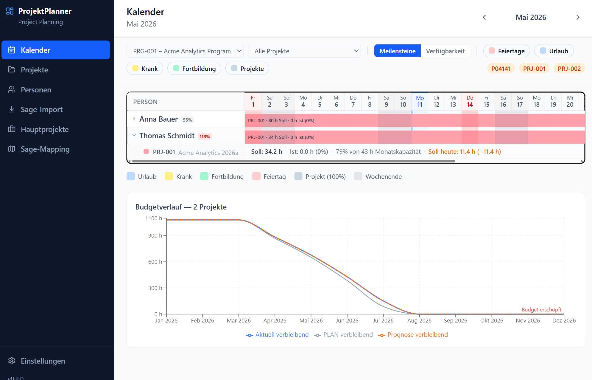
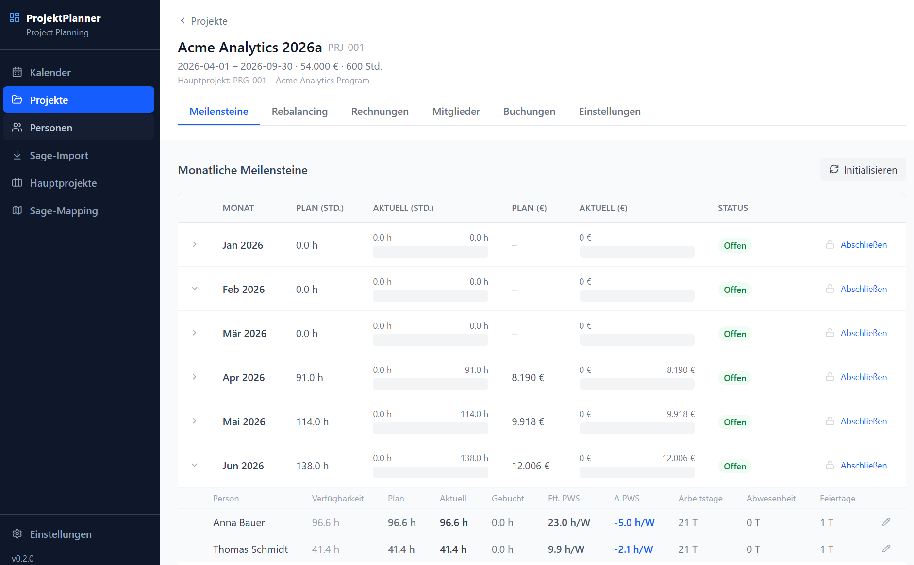
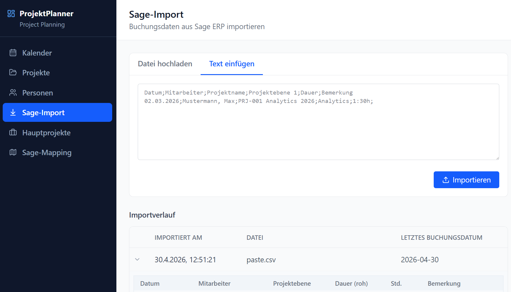
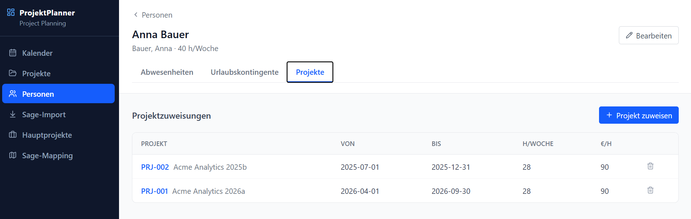

# ProjektPlanner

A local-first web app for project time planning and billing tracking.
Import Sage ERP time bookings, plan monthly milestones per person, and track budget burn in hours and euros.

---

## Screenshots

| Calendar — monthly resource grid | Project — milestone table & budget |
|---|---|
|  |  |

| Sage ERP import with mapping resolver | Person detail — absences & vacation |
|---|---|
|  |  |

---

## Features

- **Calendar view** — monthly resource grid per person with toggleable layers: public holidays, absences, project assignments, and milestone status
- **Milestone planning** — initialize per-person hour budgets from capacity, holidays, and absence estimates; track drift month by month as reality changes
- **Budget tracking** — progress bars for hours and euros consumed vs. planned; rebalancing suggestions for remaining months
- **Sage ERP import** — paste or upload CSV exports; auto-detects separator; guided project-mapping resolver for unmapped bookings
- **Invoice records** — close months to lock milestones and generate a Zahlungsplan; reopen with confirmation
- **Person management** — vacation contingents, sick leave, training absences; default billing rate and weekly capacity per person
- **Programs** — group projects under a Hauptprojekt; filter calendar and reports by program

---

## Quick start

> **Prerequisites:** Python 3.12+, Node.js 20+, and [uv](https://docs.astral.sh/uv/)
> ```bash
> pip install uv          # or: winget install astral-sh.uv
> ```

### 1 — Start the backend

```bash
cd backend
uv sync
uv run uvicorn app.main:app --reload --port 8000
```

API running at `http://localhost:8000` · Interactive docs at `http://localhost:8000/docs`

### 2 — Start the frontend

```bash
cd frontend
npm install
npm run dev
```

Open `http://localhost:5173` — the frontend proxies `/api/*` to the backend automatically.

### 3 — Seed demo data (optional)

```bash
cd backend
uv run python scripts/seed.py
```

Creates two fictional projects (Acme Corp), two persons, memberships, billing positions, and initialized milestones — no real names or figures.

---

## Running tests

```bash
# Backend unit tests
cd backend && uv run pytest

# Frontend unit tests
cd frontend && npm test

# E2E tests (requires both servers running)
cd frontend && npm run test:e2e
```

---

## Tech stack

| Layer | Technology |
|---|---|
| Backend | FastAPI + SQLModel + SQLite (WAL mode) |
| Package manager | uv (Python 3.12+) |
| Frontend | React 19 + Vite + TypeScript |
| Styling | Tailwind CSS v4 |
| State / data | TanStack Query v5 |
| Tests | pytest · Vitest · Playwright |
| Holiday data | feiertage-api.de (cached in DB) |

---

## Project structure

```
backend/
  app/
    main.py           FastAPI app + router registration
    routers/          One file per domain (projects, persons, calendar, …)
    models/           SQLModel entities
    services/         Business logic (holidays, planning math, import)
  scripts/seed.py     Demo data seeder (fictional data only)
  tests/              pytest suite
  alembic/            DB migrations

frontend/
  src/
    api.ts            Typed API client (all endpoints)
    pages/            One file per route
    components/       Shared UI components
  e2e/                Playwright end-to-end tests

docs/
  plan-architecture.md  System architecture and data flow
  implementation/       Step-by-step implementation notes
```

---

## Deployment (Linux, firm LAN)

The production stack runs via Docker Compose: a FastAPI backend (uvicorn, migrations
applied on start) reachable only inside the compose network, plus the built SPA served
by nginx which reverse-proxies `/api` to the backend. SQLite lives in a named volume.

**Prerequisites on the host:** Docker Engine + the Compose plugin, and network access
to the public holiday APIs (feiertage-api.de / openholidays / nager.at).

```bash
# 1) Get the code (GitHub is the source of truth)
git clone https://github.com/sefalk/ProjektPlanner.git
cd ProjektPlanner

# 2) Build & start (published on port 8080 by default; override with WEB_PORT)
WEB_PORT=8080 docker compose -f docker-compose.prod.yml up -d --build

# 3) Open from inside the LAN
#    http://<host-ip>:8080     (e.g. http://192.168.100.141:8080)
```

**Update to a new version:**

```bash
git pull
docker compose -f docker-compose.prod.yml up -d --build   # migrations run automatically
```

**Operations:**

```bash
docker compose -f docker-compose.prod.yml ps        # status
docker compose -f docker-compose.prod.yml logs -f   # follow logs
docker compose -f docker-compose.prod.yml down      # stop (data volume is kept)
```

### With login + HTTPS (server variant)

`docker-compose.server.yml` puts a reverse proxy (TLS + HTTP Basic Auth) in front;
the app itself is not published, only the proxy (ports 80/443). One shared login,
one DB (see issue #45). Host-side secrets live outside the repo at
`/home/<user>/pp-secrets/`:

```bash
# once: create the secrets dir, a self-signed cert, and the (nginx) login
mkdir -p ~/pp-secrets
openssl req -x509 -newkey rsa:2048 -nodes -days 825 \
  -keyout ~/pp-secrets/key.pem -out ~/pp-secrets/cert.pem \
  -subj "/CN=$(hostname)" -addext "subjectAltName=IP:<host-ip>,DNS:$(hostname)"
htpasswd -cB ~/pp-secrets/htpasswd <login-name>     # prompts for the password

# once: app secrets — first-admin bootstrap + session signing key (see below)
cp deploy/server-secrets.env.example ~/pp-secrets/server.env
#   → edit ~/pp-secrets/server.env: set ADMIN_EMAIL + a strong ADMIN_PASSWORD,
#     and AUTH_SECRET=$(openssl rand -hex 32).  chmod 600 ~/pp-secrets/server.env

# start / update
docker compose -f docker-compose.server.yml up -d --build
#   → https://<host-ip>   (self-signed cert → browser warning is expected)
```

**First login / entry point.** There is no built-in default admin. On the very
first start with an empty database, the backend creates exactly one superuser
from `ADMIN_EMAIL`/`ADMIN_PASSWORD` in `server.env` (idempotent — ignored once any
user exists). Log in with those, then create invite tokens under **Einladungen**
so colleagues can self-register. Registration is invite-only, so without this
bootstrap nobody could get in. `AUTH_SECRET` **must** be a fresh random value
(never the dev default); the session cookie is served `Secure` behind the
forced-HTTPS proxy.

Replace the self-signed cert with an internal-CA certificate to avoid the browser
warning. Notes below apply analogously (backend not published; DB in the volume).

Notes:
- LAN-only: the host is not internet-exposed; only the nginx port (`WEB_PORT`) is
  published. The backend is not published to the host.
- The SQLite database persists in the `backend_data` volume. Back it up with
  `docker run --rm -v projektplanner_backend_data:/data -v "$PWD":/backup alpine \
   tar czf /backup/pp-db-backup.tgz -C /data .`.
- Automated deploy (ADO self-hosted agent) is a follow-up; until then use the
  `git pull … up -d --build` step above.

---

## Privacy

All person names, project numbers, billing rates, and time bookings are stored in the local SQLite database only — never sent to any server.
The database file (`backend/data/`) is excluded from version control.
Demo and development runs use fictional data exclusively.
