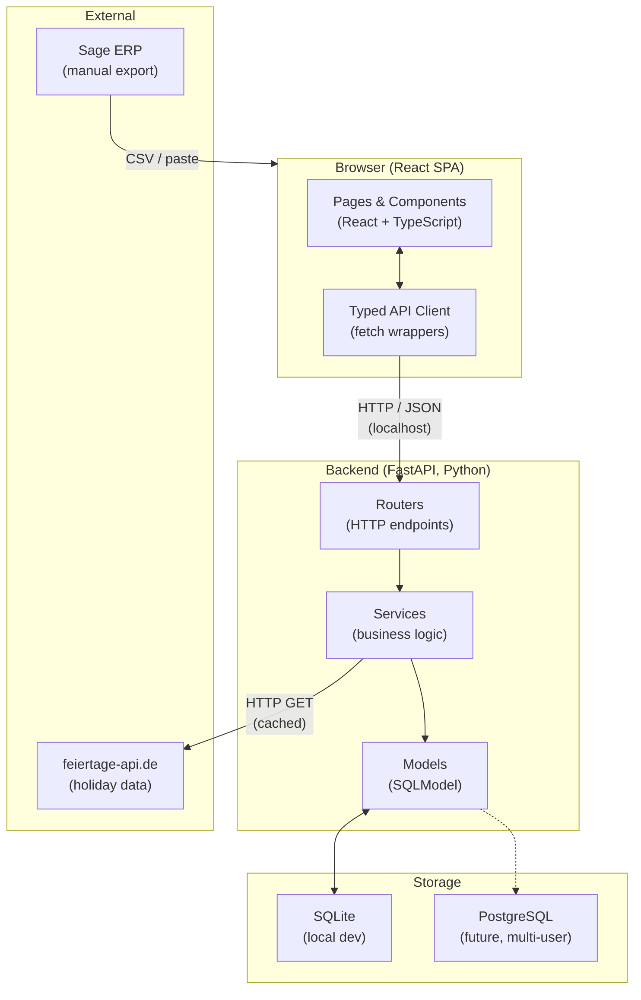
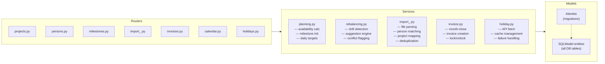
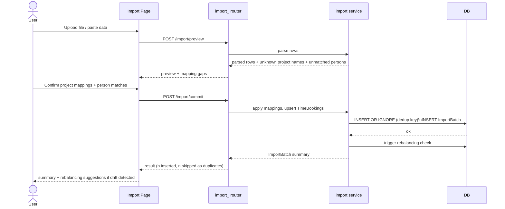
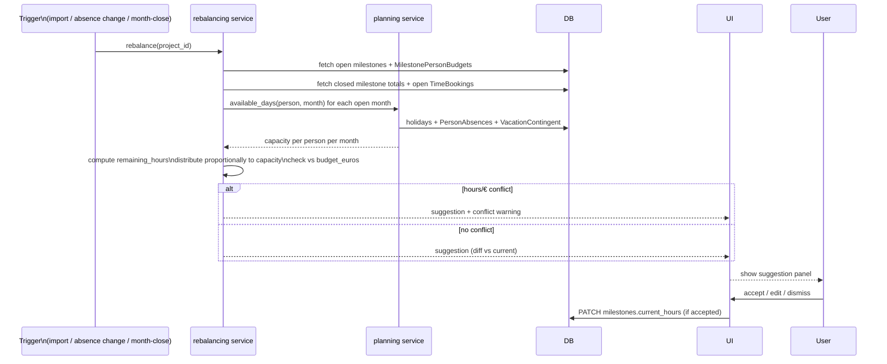
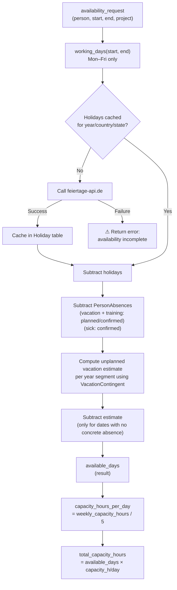

# ProjektPlanner — Architecture

_Last updated: 2026-04-22_

---

## System Overview



---

## Backend Layers



---

## Data Flow: Sage Import



---

## Data Flow: Milestone Rebalancing



---

## Data Flow: Month-End Close

```mermaid
sequenceDiagram
    actor User
    participant UI as Project Detail Page
    participant Router as milestones router
    participant InvoiceSvc as invoice service
    participant DB

    User->>UI: Click "Close Month" for milestone M
    UI->>Router: GET /milestones/{id}/close-check
    Router->>DB: fetch last ImportBatch.last_booking_date for project
    DB-->>Router: last import date
    Router-->>UI: warning if last_booking_date < end_of_month(M)

    User->>UI: Confirm close (with or without warning)
    UI->>Router: POST /milestones/{id}/close
    Router->>InvoiceSvc: close_milestone(milestone_id)
    InvoiceSvc->>DB: SET milestone.status=closed, is_locked=true
    InvoiceSvc->>DB: SUM TimeBookings per person for month M
    InvoiceSvc->>DB: INSERT MonthlyInvoice + InvoicePersonEntries
    InvoiceSvc->>DB: trigger rebalancing for remaining open milestones
    InvoiceSvc-->>Router: invoice_id
    Router-->>UI: invoice created, milestone locked
    UI-->>User: padlock icon shown; Zahlungsplan updated
```

---

## Data Flow: Availability Calculation



---

## Technology Interaction Summary

| What | Technology | Why |
|---|---|---|
| SPA framework | React + Vite + TypeScript | Component model, type safety, ecosystem |
| UI primitives | shadcn/ui + Tailwind | Unstyled-by-default, composable, no lock-in |
| API layer | FastAPI | Python, async, auto OpenAPI docs, Pydantic validation |
| Data models | SQLModel | SQLAlchemy + Pydantic unified; works with FastAPI natively |
| DB (local) | SQLite | Zero-config, single file, no server process |
| DB (scaled) | PostgreSQL | Connection-string swap; Alembic handles schema |
| Migrations | Alembic | Works with SQLModel; auto-generates scripts; supports SQLite + Postgres |
| Config | python-dotenv `.env` | DB URL, API endpoints, defaults; never in code |
| Holiday data | feiertage-api.de | Free, no auth; cached; fallback to OpenHolidays |
| Sage data | Manual file/paste | No API exists; import wizard with dedup + mapping |
| Python pkgs | uv | Fast resolver, lockfile, virtual env management |
| JS pkgs | pnpm | Fast, deterministic, disk-efficient |
| Backend tests | pytest | Unit tests mandatory for planning + rebalancing services |
| Frontend tests | Vitest | Unit tests for calculation utilities |

---

## Key Invariants (enforced by service layer)

1. `Σ MilestonePersonBudget.current_hours == Milestone.current_hours` for every milestone
2. `PersonAbsence.status=ongoing` is only valid when `absence_type=sick`
3. `PersonAbsence.status=planned` is only valid when `absence_type ∈ {vacation, training}`
4. A closed/locked Milestone's `initial_hours` and `InvoicePersonEntry` records are immutable without explicit unlock
5. `TimeBooking` deduplication: `UNIQUE(date, person_id, project_id, sage_project_level, net_hours)` — re-importing the same export is safe
6. `Holiday` table must be populated before availability is computed for any period — failure returns a warning, not a silent wrong result
